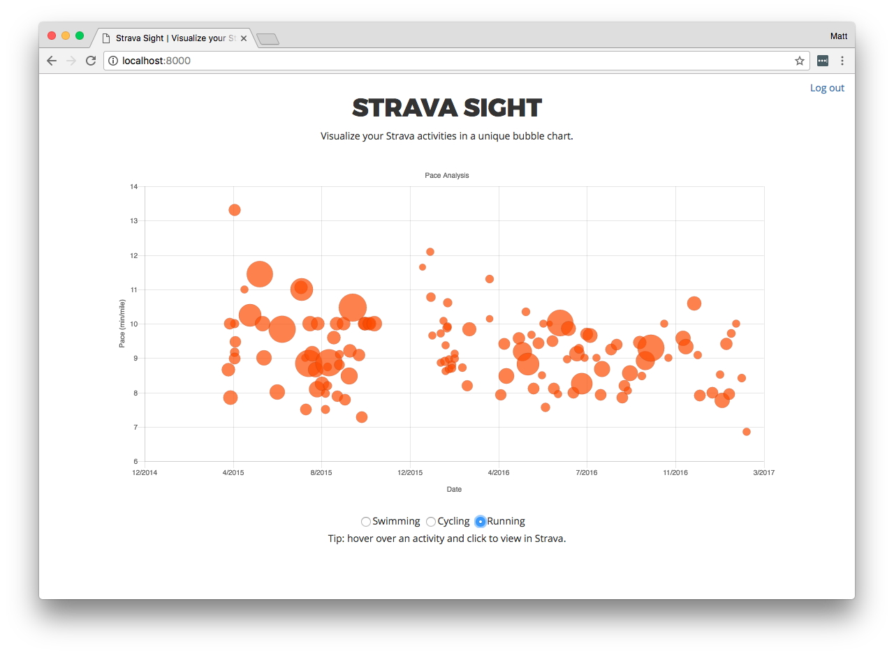

# Strava Sight

Visualize your Strava activities in a unique bubble chart. Example:

## Design

See <a href="./DESIGN.md">DESIGN.md</a>.

Technologies used:

* React.js and Chart.js
* MySQL
* Golang

## Running the application

### Frontend

    cd js && make install && make start

### Backend

### Create and configure your MySQL database

Install MySQL and run the following commands in the root console.

    create database stravasight;
    create user 'stravasight'@'%';
    grant all privileges on stravasight.* to 'stravasight'@'%' with grant option;

### Export Strava variables in your environment

    export STRAVA_CLIENT_ID=<redacted>
    export STRAVA_CLIENT_SECRET=<redacted>

#### Run Go code

    cd go && make install && make start

Note that running this command will export default MySQL env variables for your
convenience. In production, set these appropriately.
